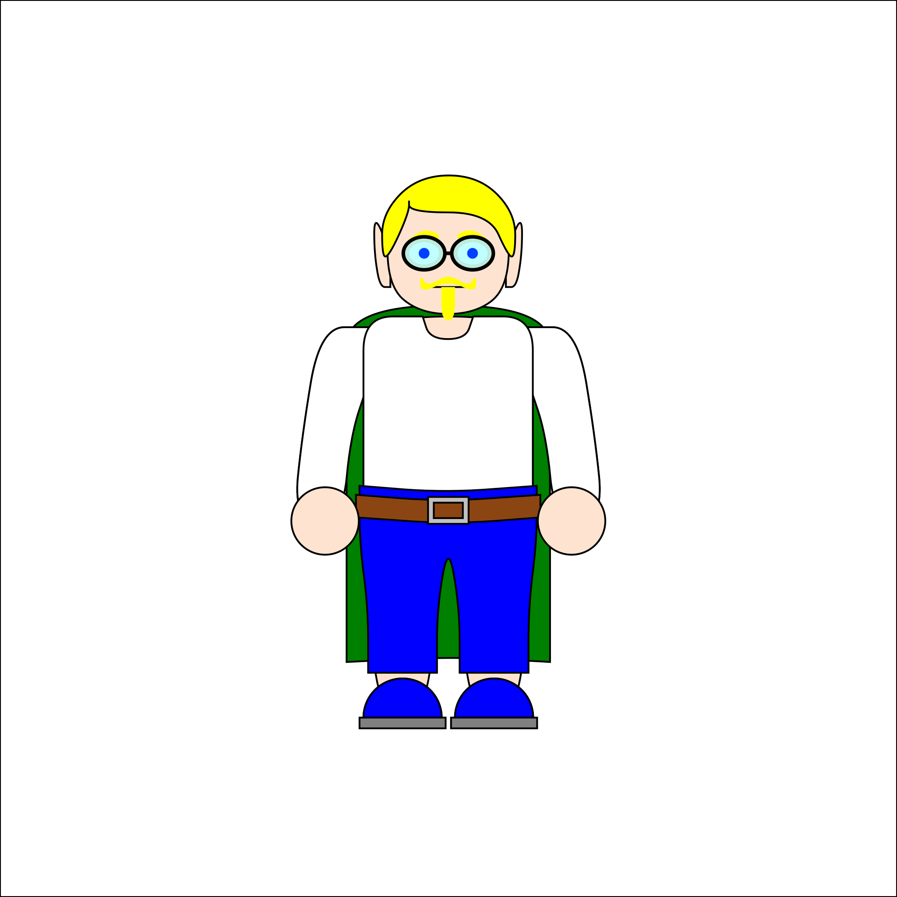
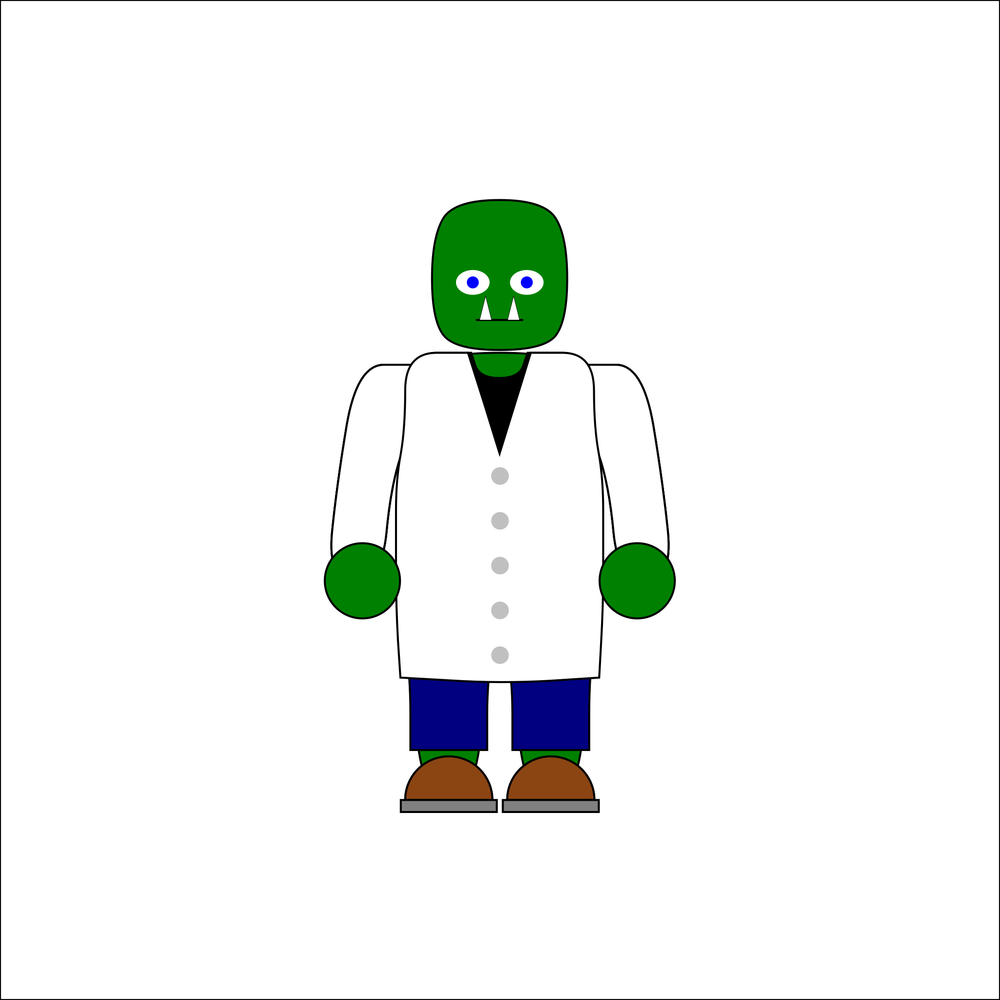
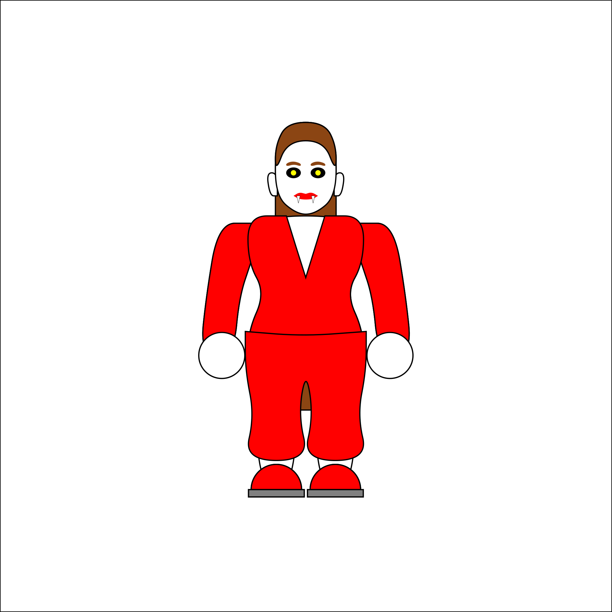

= Orchaldir's RPG Tools

This repo is a collection of tools for game masters of tabletop role-playing games.

== Characters

By combing different appearance & clothing options, a large number of characters can be generated.

.An Elf

.An Orc

.A Vampire

.A Devil
image:resources/characters/devil.svg[A Devil,width=50%]